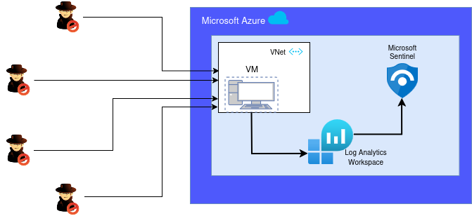
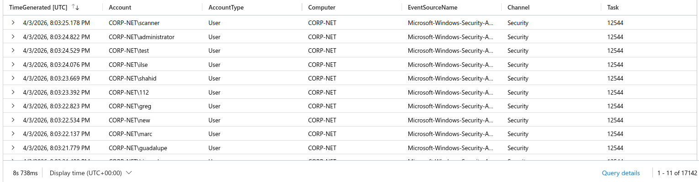
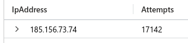
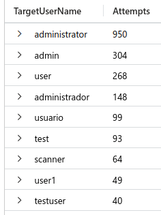
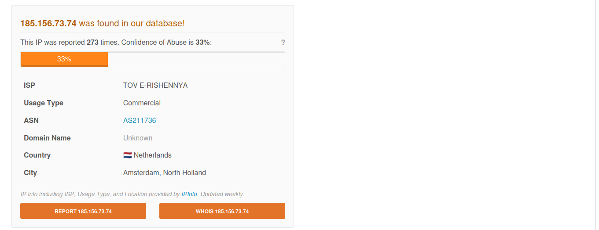
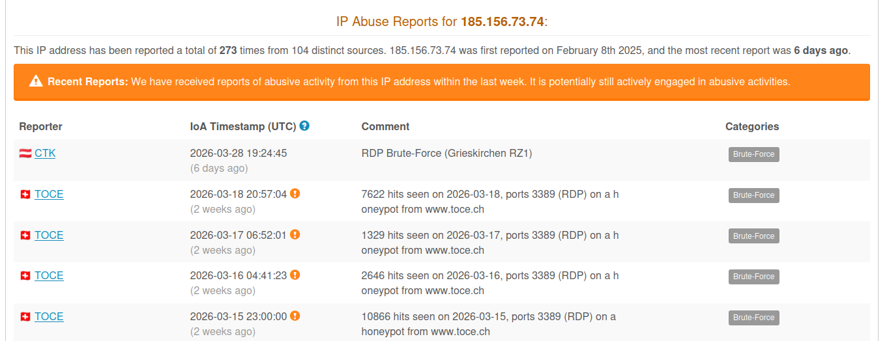

# Honeypot-Based Threat Detection and Incident Response Lab


## Overview

This project demonstrates the design and implementation of a home lab SIEM (Security Information and Event Management) using **Microsoft Sentinel** on Azure.

A vulnerable environment was created by deploying a Windows Virtual Machine exposed to the internet, acting as a honeypot to attract real-world attack attempts.

Security events generated by the VM are collected and forwarded to a centralized **Log Analytics Workspace**, where they are ingested, analyzed, and correlated using **Microsoft Sentinel**.

The lab includes:

- Deployment of an Azure Virtual Machine configured as a honeypot  
- Centralized log collection through a Log Analytics Workspace  
- Integration with Microsoft Sentinel for monitoring, detection, and analysis  
- Ingestion of Windows Security Events using Data Collection Rules  
- Detection of failed login attempts and suspicious activity using KQL queries  
- Identification of brute-force attack patterns  
- Threat intelligence validation: observed IPs were cross-referenced with threat intelligence sources to assess malicious activity. This reflects a key analyst workflow, where confirmed malicious indicators should be escalated and blocked accordingly

This project focuses on real-world attack visibility, detection engineering, and security analysis from a defensive perspective.


## Architecture




## Attack Analysis & Detection

Thousands of "Security Event" logs were detected in Log Analytics Workspace. This volume of events is highly unusual for a single machine and indicates potential malicious activity.





Windows Security Events were analyzed and it was detected that the Event ID is 4625 which is a failed logon attempt. The presence of Logon Type 3 indicates network-based authentication attempts, typically associated with access to shared resources. While this may be related to remote activity, it does not exclusively confirm RDP usage.


### 1️⃣ Evidence from Collected Data

- A single source IP generated **17,142 failed login attempts within a 3-hour period**, clearly indicating automated brute-force behavior

  
  
  
  
- Common usernames observed:

  

These patterns demonstrate systematic credential guessing using widely known default or weak account names.

### 2️⃣ Analysis

Key indicators identified in the logs include:

- Repeated failed authentication attempts (Event ID 4625) 
- High-frequency login attempts within short time intervals, suggesting automation  
- Multiple common username variations being tested, indicating credential guessing or credential stuffing  
- Repeated attempts originating from the same external IP addresses 


This behavior is consistent with internet-wide scanning and opportunistic attacks targeting exposed RDP services and use of automated attack tools rather than manual interaction.

### 3️⃣ Security Implications

This type of activity highlights the risks associated with exposing remote access services to the internet without proper safeguards.

It reinforces the importance of:

- Continuous monitoring and log analysis 
- Detection of brute-force patterns 
- Implementation of defensive controls such as access restrictions and IP blocking
- Integration of threat intelligence to identify and respond to known malicious sources
- Do not expose remote access services to the internet if not needed.


### 4️⃣ Useful KQL Queries

Identify failed login attempts in the last 3 hours:

```kusto
SecurityEvent
| where TimeGenerated > ago(3h)
| where EventID == 4625
| summarize Attempts = count() by IpAddress
| sort by Attempts desc
```


Identify target usernames used:

```kusto
SecurityEvent
| where EventID == 4625
| where TimeGenerated > ago(3h)
| summarize Attempts = count() by TargetUserName
| sort by Attempts desc  
```

---


## Incident Response

Following the detection of suspicious activity, a basic incident response workflow was performed.

### 1️⃣ Threat Intelligence Validation

The source IP address was cross-referenced using threat intelligence platforms such as AbuseIPDB to assess its reputation.

The results confirmed that the IP had been previously reported multiple times for malicious activity, including RDP brute-force attempts.

  



### 2️⃣ Containment – IP Blocking

As a containment measure, the identified malicious IP address was blocked.

- Inbound traffic from the source IP was denied
- Rules were created to prevent further communication attempts

This step effectively mitigates further brute-force attempts from the identified source.

---
  
### 3️⃣ Response Workflow

The response followed a standard security workflow:

1. Detection of suspicious activity (failed login attempts) 
2. Log analysis and pattern identification 
3. Threat intelligence validation 
4. Containment through IP blocking 

This structured approach reflects a typical analyst workflow in a Security Operations Center (SOC) environment.


## Video

👉 [Link to the YouTube video](https://www.youtube.com/...)
